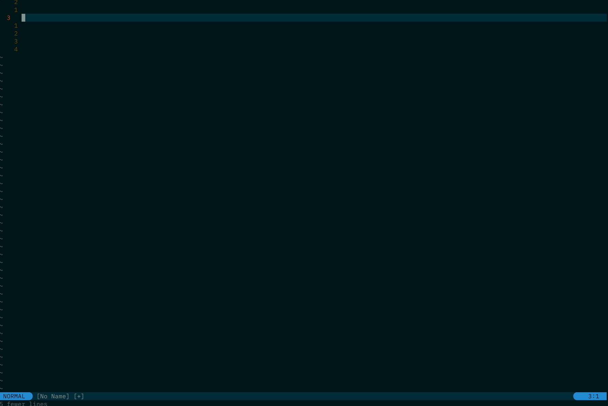

# Shortie

A very simple text expander. Kind of like [espanso](https://espanso.org/) but worse in every way.



#### shortie-cli
```bash
Usage: shortie <COMMAND>

Commands:
  start   Start shortie-daemon
  stop    Stop shortie-daemon
  reload  Reload shortie-daemon
  status  See status of shortie-daemon
  help    Print this message or the help of the given subcommand(s)

Options:
  -h, --help  Print help
```

#### shortie start
```
Usage: shortie start [OPTIONS]

Options:
  -c, --config <CONFIG>  Path to the directory containing .yaml config files 
  -p, --pid <PID>        Path to the directory containing temporary .pid file
  -h, --help             Print help
```

#### shortie-daemon
```bash
Usage: shortied --config <CONFIG>

Options:
  -c, --config <CONFIG>  Path to the directory containing .yaml config files
  -h, --help             Print help
```

### Example Config 
`.config/shortie/config.yaml` (supports multiple config files)
```yaml
prefix: ";"
shorts:
  - name: "l3"
    output: "localhost:3000"
  - name: "l4"
    output: "localhost:4321"
  - name: "l5"
    output: "localhost:5173"
```

### Example Usage
```bash
shortie start
```

```
;l3 -> localhost:3000 
;l4 -> localhost:4321 
;l5 -> localhost:5173 
```
